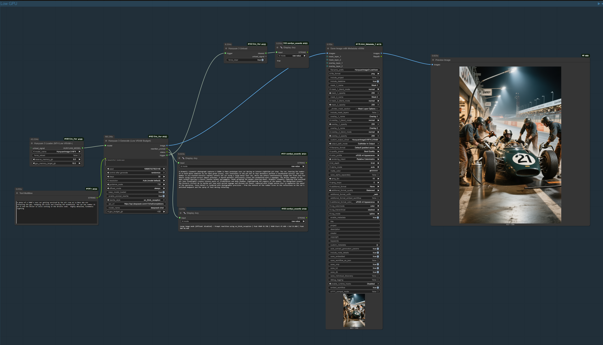

# 🎨 HunyuanImage-3.0 ComfyUI Custom Nodes

[](http://creativecommons.org/licenses/by-nc/4.0/)
[](https://www.python.org/downloads/)
[](https://github.com/comfyanonymous/ComfyUI)

Professional ComfyUI custom nodes for [Tencent HunyuanImage-3.0](https://github.com/Tencent-Hunyuan/HunyuanImage-3.0), the powerful 80B parameter native multimodal image generation model.

> **Latest — v1.2.0**
> - 🎨 **Instruct Resolution Overhaul**: All 33 model-native bucket resolutions now available in the dropdown — from 512×2048 (1:4 Tall) through 1024×1024 (1:1 Square) to 2048×512 (4:1 Wide). Ordered tallest portrait → square → widest landscape.
> - 🔀 **Multi-Image Fusion expanded to 5 inputs**: Image slots 4 and 5 added as experimental inputs (model officially supports 3, but the pipeline accepts more).
> - 🛡️ **Transformers 5.x compatibility**: All `_lookup` dict guard, `BitsAndBytesConfig` import, and `modeling_utils` attribute checks updated for forward compatibility.
> - 🐛 **NF4 Low VRAM OOM fix** (Issue #16): Two-stage `max_memory` estimation replaces the one-shot approach that left no headroom for inference.
> - 🐛 **Multi-GPU device mismatch fix** (Issue #15): Explicit `.to(device)` calls on `freqs_cis` / `image_pos_id` prevent cross-device errors during block-swap.
> - 🧹 **Code quality pass**: Dead imports removed, missing OOM handlers added to Instruct nodes, multi-GPU block-swap patch applied consistently.
>
> **Previous highlights:**
> - 🚀 **HighRes Efficient generate node** enables 3MP–4K+ generation on 96GB GPUs by replacing the memory-hungry MoE dispatch_mask with a loop-based expert routing that uses ~75× less VRAM. See [High-Resolution Generation](#-high-resolution-generation-highres-efficient) below.
> - ✅ **NF4 Low VRAM Loader + Low VRAM Budget generator are verified on 24‑32 GB cards** thanks to the custom device-map strategy that pins every quantized layer on GPU.
> - ✅ **INT8 Budget loader works end-to-end** and a pre-quantized checkpoint is available on Hugging Face: [EricRollei/Hunyuan_Image_3_Int8](https://huggingface.co/EricRollei/Hunyuan_Image_3_Int8) for anyone who wants INT8 quality without running the quantizer locally.
> - 📸 Added a reference workflow (below) showing the recommended node pair for Low VRAM setups.

> **🙏 Acknowledgment**: This project integrates the HunyuanImage-3.0 model developed by **Tencent Hunyuan Team** and uses their official system prompts. The model and original code are licensed under [Apache 2.0](https://github.com/Tencent-Hunyuan/HunyuanImage-3.0/blob/main/LICENSE). This integration code is separately licensed under CC BY-NC 4.0 for non-commercial use.

## 📋 TODO / Known Issues

- [x] **NF4 Low VRAM Loader**: Custom device map keeps NF4 layers on GPU so 24‑32 GB cards can use the Low VRAM Budget workflow without bitsandbytes errors.
- [x] Provide example workflow/screenshot for Low VRAM users (see below).- [x] **Instruct nodes**: Loader, Generate, Image Edit, Multi-Image Fusion, and Unload nodes for Instruct models.
- [x] **Instruct block swap**: BF16, INT8, and NF4 Distil models verified working with block swap.
- [ ] **Instruct non-distil INT8**: OOM under investigation — the full (non-distilled) Instruct INT8 model with block swap currently fails during inference. Distil-INT8 works fine. See [Known Limitations](#known-limitations) below.- [ ] Add screenshots/documentation for every node (in progress).
- [ ] Test and document multi-GPU setup.
- [ ] Continue long-run stability testing on the INT8 Budget loader with CPU offload edge cases.

## 🎯 Features

- **Multiple Loading Modes**: Full BF16, INT8/NF4 Quantized, Single GPU, Multi-GPU
- **Smart Memory Management**: Automatic VRAM tracking, cleanup, and optimization
- **High-Quality Image Generation**: 
  - Standard generation (<2MP) - Fast, GPU-only
  - Large image generation (2MP-8MP+) - CPU offload support
- **Instruct Model Support** (NEW):
  - Built-in Chain-of-Thought (CoT) prompt enhancement — no external API needed
  - Image-to-Image editing with natural language instructions
  - Multi-image fusion (combine 2–5 reference images; 4–5 experimental)
  - Block swap for BF16/INT8/NF4 models on 48–96GB GPUs
- **Advanced Prompting**:
  - Optional prompt enhancement using official HunyuanImage-3.0 system prompts
  - Supports any OpenAI-compatible LLM API (DeepSeek, OpenAI, Claude, local LLMs)
  - Two professional rewriting modes: en_recaption (structured) and en_think_recaption (advanced)
- **Professional Resolution Control**:
  - All 33 model-native bucket resolutions (~1MP each) in the dropdown
  - Ordered tallest portrait (512×2048) → square (1024×1024) → widest landscape (2048×512)
  - Aspect ratio labels and Auto resolution option
- **Production Ready**: Comprehensive error handling, detailed logging, VRAM monitoring

## 📦 Installation

### Prerequisites

- ComfyUI installed and working
- NVIDIA GPU with CUDA support
- **Minimum 24GB VRAM** for NF4 quantized model
- **Minimum 80GB VRAM** (or multi-GPU) for full BF16 model
- Python 3.10+
- PyTorch 2.9+ with CUDA 12.8+ (recommended for best performance)

### System Requirements & Hardware Recommendations

The hardware requirements depend heavily on which model version you use.

#### 1. Full BF16 Model (Original)
This is the uncompressed 80B parameter model. It is massive.
- **Model Size**: ~160GB on disk.
- **VRAM**: 
  - **Ideal**: 80GB+ (A100, H100, RTX 6000 Ada). Runs entirely on GPU.
  - **Minimum**: 24GB (RTX 3090/4090). *Requires massive System RAM.*
- **System RAM (CPU Memory)**:
  - If you have <80GB VRAM, the model weights that don't fit on GPU are stored in RAM.
  - **Requirement**: **192GB+ System RAM** is recommended if using a 24GB card.
  - *Example*: On a 24GB card, ~140GB of weights will live in RAM.
- **Performance**:
  - On low VRAM cards, generation will be slow due to swapping data between RAM and VRAM.

#### 2. NF4 Quantized Model (Recommended)
This version is compressed to 4-bit, reducing size by ~4x with minimal quality loss.
- **Model Size**: ~45GB on disk.
- **VRAM**:
  - **Ideal**: 48GB+ (RTX 6000, A6000). Runs entirely on GPU.
  - **Minimum**: 24GB (RTX 3090/4090).
    - *Note*: Since 45GB > 24GB, about half the model will live in System RAM.
    - **Performance**: Slower than 48GB cards, but functional.
- **System RAM**: 
  - **64GB+ recommended** (especially for 24GB VRAM cards to hold the offloaded weights).
- **Performance**: Much faster on consumer hardware.

#### 3. INT8 Quantized Model (High Quality)

This version is compressed to 8-bit, offering near-original quality with reduced memory usage.
- **Model Size**: ~85GB on disk.
- **VRAM**:
  - **Ideal**: 80GB+ (A100, H100). Runs entirely on GPU.
  - **Minimum**: 24GB (RTX 3090/4090).
    - *Note*: Significant CPU offloading required (~60GB of weights in RAM).
- **System RAM**: 
  - **128GB+ recommended**.
- **Performance**: 
  - **Quality**: ~98% of full precision (better than NF4).
  - **Speed**: Faster inference than NF4 (less dequantization overhead) but requires more memory transfer if offloading.
  - **Practical Requirement**: For the selective INT8 checkpoints shipped here, you realistically need a 96GB-class GPU (RTX 6000 Pro Blackwell, H100, etc.). Forcing CPU offload on smaller cards makes each step take minutes because the quantized tensors continually stream over PCIe.

#### 4. Instruct Models (NEW)

The Instruct family adds built-in prompt enhancement, image editing, and multi-image fusion.
They come in two variants:

- **Instruct** (full): 50-step inference, uses CFG (batch=2 during diffusion), highest quality.
- **Instruct-Distil**: 8-step inference, CFG-distilled (batch=1), ~6× faster, same quality.

Both variants are available in BF16, INT8, and NF4 quantization.

| Variant | Quant | Disk Size | Min VRAM | Block Swap | Status |
|---------|-------|-----------|----------|------------|--------|
| Instruct-Distil | NF4 | ~45 GB | 48 GB | Optional | ✅ Working |
| Instruct-Distil | INT8 | ~81 GB | 96 GB | Required | ✅ Working |
| Instruct-Distil | BF16 | ~160 GB | 96 GB | Required | ✅ Working |
| Instruct (full) | NF4 | ~45 GB | 48 GB | Optional | ✅ Working |
| Instruct (full) | INT8 | ~81 GB | 96 GB | Required | ⚠️ Under investigation |
| Instruct (full) | BF16 | ~160 GB | 96 GB | Required | ✅ Working |

### Quick Install

1. **Clone this repository** into your ComfyUI custom nodes folder:
```bash
cd ComfyUI/custom_nodes
git clone https://github.com/ericRollei/Eric_Hunyuan3.git
```

2. **Install dependencies**:
```bash
cd Eric_Hunyuan3
pip install -r requirements.txt
```

3. **Download model weights**:

**Option A: Full BF16 Model (~80GB)**
```bash
# Download to ComfyUI/models/
cd ../../models
huggingface-cli download tencent/HunyuanImage-3.0 --local-dir HunyuanImage-3
```

**Option B: Download Pre-Quantized NF4 Model (~20GB)** - *Recommended for single GPU <96GB*
You can download the pre-quantized weights directly from Hugging Face:
[EricRollei/HunyuanImage-3-NF4-ComfyUI](https://huggingface.co/EricRollei/HunyuanImage-3-NF4-ComfyUI)

```bash
# Download to ComfyUI/models/
cd ../../models
huggingface-cli download EricRollei/HunyuanImage-3-NF4-ComfyUI --local-dir HunyuanImage-3-NF4
```

**Option C: Download Pre-Quantized INT8 Model (~85GB)**
If you want maximum fidelity without running the INT8 quantizer locally, grab the ready-to-go checkpoint:
[EricRollei/Hunyuan_Image_3_Int8](https://huggingface.co/EricRollei/Hunyuan_Image_3_Int8)

```bash
# Download to ComfyUI/models/
cd ../../models
huggingface-cli download EricRollei/Hunyuan_Image_3_Int8 --local-dir HunyuanImage-3-INT8
```

**Option D: Quantize Yourself (from Full Model)**
If you prefer to quantize it yourself:
```bash
# First download full model (Option A), then quantize
cd path/to/Eric_Hunyuan3/quantization
python hunyuan_quantize_nf4.py \
  --model-path "../../models/HunyuanImage-3" \
  --output-path "../../models/HunyuanImage-3-NF4"
```

**Option E: Download Instruct Models**

Download Instruct models into your `ComfyUI/models/` directory so the loader can find them automatically. Pre-quantized INT8 and NF4 variants are available from [EricRollei on Hugging Face](https://huggingface.co/EricRollei):

```bash
cd ComfyUI/models

# Pre-quantized INT8 Instruct-Distil (~81GB) — RECOMMENDED for 96GB GPUs
huggingface-cli download EricRollei/HunyuanImage-3.0-Instruct-Distil-INT8 \
  --local-dir HunyuanImage-3.0-Instruct-Distil-INT8

# Pre-quantized NF4 Instruct-Distil (~45GB) — for 48GB GPUs
huggingface-cli download EricRollei/HunyuanImage-3.0-Instruct-Distil-NF4 \
  --local-dir HunyuanImage-3.0-Instruct-Distil-NF4
```

See [Instruct Models](#-instruct-models-new) for the full list, HF links, and extra_model_paths.yaml setup for custom locations.

4. **Restart ComfyUI**

## 🚀 Usage

### 📸 Low VRAM Workflow Reference



Pair **Hunyuan 3 Loader (NF4 Low VRAM+)** with **Hunyuan 3 Generate (Low VRAM Budget)** for 24‑32 GB cards. The loader’s GPU budget slider keeps 18–20 GB free for inference while the generator adds smart telemetry and optional prompt rewriting. The screenshot above shows a full working chain (loader → rewriter → Low VRAM Budget generator → save/display) producing a 1600×1600 render on a 24 GB test rig without triggering bitsandbytes validation.

### Node Overview

#### 📦 Loader Nodes

| Node | Best For | NOT For | Key Features |
|------|----------|---------|--------------|
| **Hunyuan 3 Loader (NF4)** | • 45-48GB+ VRAM<br>• Fast quantized loading<br>• Simple setup | • 24-32GB VRAM (use Low VRAM+)<br>• When you need device_map control | Fast NF4 load. Full model on GPU. ~45GB VRAM. |
| **Hunyuan 3 Loader (NF4 Low VRAM+)** | • **24-32GB VRAM**<br>• Budget-constrained setups<br>• device_map offloading | • 48GB+ VRAM (use standard NF4) | Auto memory management. `external_vram_gb` for shared GPU. |
| **Hunyuan 3 Loader (INT8 Budget)** | • **80-96GB VRAM**<br>• Better quality than NF4<br>• Production workflows | • <80GB VRAM (use NF4)<br>• Speed-critical workflows | Auto memory management. ~82GB model. Higher quality than NF4. |
| **Hunyuan 3 Loader (Full BF16)** | • 80GB+ VRAM<br>• Maximum quality<br>• No quantization artifacts | • <80GB VRAM<br>• Quick experimentation | Full precision. ~80GB VRAM. Best quality. |
| **Hunyuan 3 Loader (Full BF16 GPU)** | • Single 80GB+ GPU<br>• Memory control needed | • Multi-GPU setups<br>• <80GB VRAM | Single GPU with reserve slider. |
| **Hunyuan 3 Loader (Multi-GPU BF16)** | • Multi-GPU setups<br>• Distributed inference | • Single GPU setups | Splits model across GPUs. |
| **Hunyuan 3 Loader (88GB GPU Optimized)** | ❌ **DEPRECATED** | Everything | Use Full BF16 Loader instead. |

#### 🔧 Utility Nodes

| Node | Best For | NOT For | Key Features |
|------|----------|---------|--------------|
| **Hunyuan 3 Unload** | • Simple VRAM cleanup<br>• Between workflows<br>• Manual control | • Fast model switching (use Soft Unload)<br>• Emergency cleanup (use Force Unload) | Standard cleanup. `clear_for_downstream` option. |
| **Hunyuan 3 Soft Unload (Fast)** | • **Fast model switching**<br>• Multi-model workflows<br>• NF4/INT8 models | • Final cleanup (model stays in RAM)<br>• RAM-constrained systems | Parks model in CPU RAM. ~5s restore vs ~90s reload. Requires bitsandbytes ≥0.48.2 for quantized. |
| **Hunyuan 3 Force Unload (Nuclear)** | • **Emergency VRAM clearing**<br>• Cross-tab VRAM pollution<br>• Stuck memory situations | • Normal workflows (too aggressive)<br>• When you want fast restore | Clears ALL cached models. gc.collect + cache clear. Nuclear option. |
| **Hunyuan 3 Clear Downstream Models** | • **Hunyuan + other models**<br>• End of workflow cleanup<br>• Keep Hunyuan loaded | • Clearing Hunyuan itself<br>• Simple single-model workflows | Clears Flux/SAM2/etc but KEEPS Hunyuan. Connect to final output. |
| **Hunyuan 3 GPU Info** | • Debugging<br>• GPU detection<br>• Memory diagnostics | • Actual workflow operations | Shows VRAM stats. Multi-GPU detection. |

#### Loader Feature Matrix

| Feature | NF4 | NF4 Low VRAM+ | INT8 Budget | Full BF16 | BF16 GPU | Multi-GPU |
|---------|:---:|:-------------:|:-----------:|:---------:|:--------:|:---------:|
| `external_vram_gb` option | ❌ | ✅ | ✅ | ❌ | ❌ | ❌ |
| Auto inference reserve | ❌ | ✅ (6GB) | ✅ (12GB) | ❌ | ❌ | ❌ |
| `device_map` support | ❌ | ✅ | ✅ | ❌ | ❌ | ❌ |
| Soft unload support | ✅ | ✅ | ✅ | ✅ | ✅ | ⚠️ |
| Min VRAM | ~45GB | ~18GB | ~55GB | ~80GB | ~75GB | 80GB split |
| Model quality | Good | Good | Better | Best | Best | Best |

#### Memory Management (NF4 Low VRAM+ & INT8 Budget)

These loaders use **automatic memory management**:

| Parameter | What It Does | When to Change |
|-----------|--------------|----------------|
| `external_vram_gb` | Reserve VRAM for **other apps** (browsers, other models) | Only if GPU is shared. Default 0 = dedicated to Hunyuan. |
| Inference reserve | **Automatic** - reserves space for VAE decode + activations | Never - handled internally (6GB for NF4, 12GB for INT8) |

**Example**: On a 96GB GPU with `external_vram_gb=0`:
- INT8 Budget: 96GB - 12GB (inference) = 84GB for model weights ✅

**Example**: On a 24GB GPU with `external_vram_gb=2` (browser running):
- NF4 Low VRAM+: 24GB - 6GB (inference) - 2GB (browser) = 16GB for model, rest spills to CPU RAM ✅

#### Utility Node Quick Reference

| Situation | Use This Node | Why |
|-----------|---------------|-----|
| Normal end of workflow | `post_action: soft_unload` | Fast restore next run |
| Running Flux after Hunyuan | Clear Downstream Models | Keeps Hunyuan, clears Flux/SAM2 |
| VRAM stuck from other tab | Force Unload (Nuclear) | Clears orphaned allocations |
| Simple cleanup, slow reload OK | Unload | Standard, reliable cleanup |
| Manual control, will reload | Unload + `clear_for_downstream` | Explicit cleanup |

> 🆕 **Simplified Memory Management**: The NF4 Low VRAM+ and INT8 Budget loaders now use automatic memory management. Inference overhead is handled internally - just set `external_vram_gb` if other apps need GPU memory (default 0 for dedicated GPU).

### 🎯 Generate Node Reference

#### Quick Decision Tree
```
Do you have 48GB+ VRAM AND model fully on GPU?
  └─ YES → Is your target resolution 3MP+ (e.g. 2048x1536)?
              └─ YES → Use "HighRes Efficient" (efficient MoE, no OOM)
              └─ NO  → Use "Hunyuan 3 Generate" (fastest)
  └─ NO  → Are you using NF4/INT8 quantized model?
              └─ YES → Use "Low VRAM" or "Low VRAM Budget"
              └─ NO  → Use "Large/Offload" or "Large Budget"
```

#### Detailed Node Comparison

| Node | Best For | NOT For | Key Features |
|------|----------|---------|--------------|
| **Hunyuan 3 Generate** | • 48GB+ VRAM<br>• Model fully on GPU<br>• Fast iteration<br>• Standard resolutions (≤2MP) | • Low VRAM (<48GB)<br>• Quantized models with CPU offload<br>• Very large images (>2MP) | Fastest option. No offload overhead. Simple controls. |
| **Hunyuan 3 Generate (Telemetry)** | • Same as above<br>• Debugging VRAM issues<br>• Performance monitoring | • Same as above | Adds RAM/VRAM stats to status output. Same speed as base Generate. |
| **Hunyuan 3 Generate (Large/Offload)** | • Large images (2-8MP+)<br>• BF16 models on <80GB VRAM<br>• When you need `offload_mode` control | • Quantized models (INT8/NF4)<br>• Quick iteration (slower startup) | Has `offload_mode` (smart/always/disabled). CPU offload for large inference. |
| **Hunyuan 3 Generate (Large Budget)** | • Same as Large/Offload<br>• Need GPU budget override<br>• Want telemetry stats | • Same as Large/Offload | Adds `gpu_budget_gb` slider and memory telemetry. |
| **Hunyuan 3 Generate (Low VRAM)** | • **NF4/INT8 quantized models**<br>• 24-48GB VRAM<br>• Models loaded with `device_map` | • BF16 models<br>• 96GB+ GPUs (use base Generate) | Skips conflicting CPU offload calls. Works with accelerate's device_map. |
| **Hunyuan 3 Generate (Low VRAM Budget)** | • Same as Low VRAM<br>• Fine-tuning memory usage<br>• Production workflows | • Same as Low VRAM | Best for quantized models. GPU budget + telemetry + smart defaults. |
| **Hunyuan 3 Generate (HighRes Efficient)** | • **3MP+ resolutions** (2K, 4K)<br>• BF16 models on 96GB GPUs<br>• When standard Large node OOMs | • Low VRAM (<48GB)<br>• NF4/INT8 quantized models | Memory-efficient MoE dispatch. ~75× less MoE intermediate VRAM. See [technical details](#-why-standard-nodes-oom-at-3mp-moe-dispatch_mask). |

#### Feature Matrix

| Feature | Generate | Telemetry | Large | Large Budget | Low VRAM | Low VRAM Budget | HighRes Efficient |
|---------|:--------:|:---------:|:-----:|:------------:|:--------:|:---------------:|:-----------------:|
| `offload_mode` control | ❌ | ❌ | ✅ | ✅ | ✅ | ✅ | ✅ |
| `gpu_budget_gb` slider | ❌ | ❌ | ❌ | ✅ | ❌ | ✅ | ❌ |
| Memory telemetry | ❌ | ✅ | ❌ | ✅ | ❌ | ✅ | ✅ (logging) |
| `vae_tiling` option | ✅ | ✅ | ✅ | ✅ | ✅ | ✅ | ❌ |
| `post_action` control | ✅ | ✅ | ✅ | ✅ | ✅ | ✅ | ✅ |
| Prompt rewriting | ✅ | ✅ | ✅ | ✅ | ✅ | ✅ | ✅ |
| device_map friendly | ⚠️ | ⚠️ | ⚠️ | ⚠️ | ✅ | ✅ | ✅ |
| Efficient MoE dispatch | ❌ | ❌ | ❌ | ❌ | ❌ | ❌ | ✅ |
| Default `post_action` | keep | keep | keep | keep | soft_unload | soft_unload | keep |

#### Recommended Pairings

| GPU VRAM | Model Type | Loader | Generator |
|----------|------------|--------|-----------|
| **96GB** | INT8 | INT8 Budget | Generate (fastest) |
| **96GB** | NF4 | NF4 | Generate (fastest) |
| **96GB** | BF16, 3MP+ | Full BF16 | **HighRes Efficient** |
| **48-80GB** | NF4 | NF4 | Generate or Low VRAM |
| **48-80GB** | BF16 | Full BF16 | Large/Offload |
| **24-32GB** | NF4 | NF4 Low VRAM+ | Low VRAM Budget |
| **24-32GB** | INT8 | INT8 Budget | Low VRAM Budget |

#### Common Mistakes

| Mistake | Problem | Solution |
|---------|---------|----------|
| Using "Generate" with NF4 on 24GB | May conflict with device_map offloading | Use "Low VRAM" or "Low VRAM Budget" |
| Using "Large/Offload" with NF4 | CPU offload hooks conflict with quantization | Use "Low VRAM" variants |
| Using "Low VRAM" on 96GB GPU | Unnecessary overhead | Use base "Generate" for speed |
| Setting `offload_mode: always` with device_map | Double offloading causes stalls | Low VRAM nodes auto-disable conflicting offload |

---

## 🆕 Instruct Models (NEW)

The **HunyuanImage-3.0-Instruct** models extend the base model with powerful new capabilities:

- **Built-in prompt enhancement** — no external LLM API needed
- **Chain-of-Thought (CoT) reasoning** — the model "thinks" about your prompt before generating
- **Image editing** — modify images with natural language instructions
- **Multi-image fusion** — combine elements from 2–5 reference images (4–5 experimental)

### Instruct vs Base Model

| Feature | Base (T2I) | Instruct |
|---------|:----------:|:--------:|
| Text-to-image | ✅ | ✅ |
| Built-in prompt enhancement | ❌ (needs API) | ✅ (CoT built-in) |
| Image editing | ❌ | ✅ |
| Multi-image fusion | ❌ | ✅ |
| Bot task modes | ❌ | ✅ (image, recaption, think_recaption) |
| CFG-distilled variant | ❌ | ✅ (8-step fast inference) |

### Instruct Node Overview

| Node | Purpose | Key Features |
|------|---------|--------------|
| **Hunyuan Instruct Loader** | Load any Instruct model variant | Auto-detects BF16/INT8/NF4 and Distil vs Full. Block swap support. |
| **Hunyuan Instruct Generate** | Text-to-image with Instruct model | Bot task modes (image/recaption/think_recaption). Returns CoT reasoning text. |
| **Hunyuan Instruct Image Edit** | Edit images with instructions | Takes input image + instruction. "Change the background to sunset." |
| **Hunyuan Instruct Multi-Image Fusion** | Combine 2–5 reference images | "Place the cat from image 1 into the scene from image 2." Images 4–5 are experimental. |
| **Hunyuan Instruct Unload** | Free memory | Clears cached Instruct model from VRAM and RAM. |

### Instruct Loader Options

| Parameter | Description | Default |
|-----------|-------------|---------|
| `model_name` | Auto-detected from `ComfyUI/models/` and `extra_model_paths.yaml` | — |
| `force_reload` | Force reload even if cached | False |
| `attention_impl` | Attention implementation (`sdpa` recommended) | sdpa |
| `moe_impl` | MoE implementation (keep `eager` unless you have flashinfer) | eager |
| `vram_reserve_gb` | VRAM to keep free for inference (auto-boosted for CFG models) | 30.0 |
| `blocks_to_swap` | Number of transformer blocks to swap between GPU↔CPU (0 = no swap) | 0 |

### Block Swap (VRAM Management)

Block swap enables running large models on GPUs that can't fit the entire model. It moves transformer blocks between GPU and CPU during the forward pass — only 1–10 blocks on GPU at a time, with async prefetching.

**When to use block swap:**
- BF16 Instruct models (~160 GB) on 96 GB GPUs → `blocks_to_swap=20-24`
- INT8 Instruct-Distil models (~81 GB) on 96 GB GPUs → `blocks_to_swap=24-28`

**Recommended settings:**

| Model | blocks_to_swap | VRAM Used | Notes |
|-------|:--------------:|-----------|-------|
| Instruct-Distil NF4 | 0 | ~29 GB | Fits on 48 GB without swap |
| Instruct-Distil INT8 | 24 | ~30 GB | ✅ Tested, working on 96 GB |
| Instruct-Distil BF16 | 22 | ~50 GB | ✅ Tested, working on 96 GB |
| Instruct (full) NF4 | 0 | ~29 GB | Fits on 48 GB without swap |
| Instruct (full) INT8 | 28-31 | ~10-17 GB | ⚠️ Under investigation — OOM during inference |
| Instruct (full) BF16 | 22 | ~50 GB | ✅ Tested, working on 96 GB |

### Bot Task Modes

The Instruct Generate node supports three modes via the `bot_task` parameter:

| Mode | Description | Steps | Best For |
|------|-------------|:-----:|----------|
| `image` | Direct generation — prompt used as-is | Fast | When you have a detailed prompt already |
| `recaption` | Model rewrites prompt into detailed description | Medium | General use — improves composition/lighting |
| `think_recaption` | CoT reasoning → rewrite → generate | Slow | Best quality — model analyzes intent first |

The `cot_reasoning` output returns the model's thought process (for `recaption` and `think_recaption`).

### Instruct Basic Workflow

```
┌─────────────────────────────────┐
│ Hunyuan Instruct Loader         │
│  model_name: HunyuanImage-3.0-  │
│    Instruct-Distil-INT8         │
│  blocks_to_swap: 24             │
└───────────┬─────────────────────┘
            │ HUNYUAN_INSTRUCT_MODEL
            ▼
┌─────────────────────────────────┐
│ Hunyuan Instruct Generate       │
│  prompt: "A cat astronaut..."   │
│  bot_task: think_recaption      │
│  resolution: 1024x1024          │
└──────┬────────┬─────────────────┘
       │        │
  IMAGE      STRING (cot_reasoning)
       │
       ▼
┌──────────────┐
│ Save Image   │
└──────────────┘
```

### Instruct Image Edit Workflow

```
┌─────────────────────┐
│ Load Image          │
└───────┬─────────────┘
        │ IMAGE
        ▼
┌─────────────────────────────────┐
│ Hunyuan Instruct Image Edit     │
│  instruction: "Add sunglasses   │
│    to the person"               │
│  bot_task: image                │
│  edit_strength: 0.7             │
└──────┬──────────────────────────┘
       │ IMAGE (edited)
       ▼
┌──────────────┐
│ Save Image   │
└──────────────┘
```

### Instruct Multi-Image Fusion Workflow

```
┌──────────────┐   ┌──────────────┐   ┌──────────────┐
│ Load Image 1 │   │ Load Image 2 │   │ Load Image 3 │  (+ optional image_4, image_5)
└──────┬───────┘   └──────┬───────┘   └──────┬───────┘
       │                  │                  │
       ▼                  ▼                  ▼
┌──────────────────────────────────────────────────────┐
│ Hunyuan Instruct Multi-Image Fusion                  │
│  instruction: "Place the cat from image 1 into the   │
│    scene from image 2 with lighting from image 3"    │
│  bot_task: think_recaption (recommended)              │
│  resolution: 1024x1024 (1:1 Square)                  │
└───────────┬──────────────────────────────────────────┘
            │ IMAGE
            ▼
     ┌──────────────┐
     │ Save Image   │
     └──────────────┘
```

> **Note:** The model officially supports up to 3 input images. Slots 4 and 5 are
> experimental — the pipeline accepts them but they increase VRAM usage significantly
> and results may vary.

### Downloading Instruct Models

**Where to put them:** Download all models (base and Instruct) into your `ComfyUI/models/` directory. All loaders automatically scan that folder.

If you store models on a separate drive, add the path to your `extra_model_paths.yaml`:
```yaml
comfyui:
    # Base models (NF4, INT8, BF16)
    hunyuan: |
        models/
        H:/MyModels/
    # Instruct models
    hunyuan_instruct: |
        models/
        H:/MyModels/
```

> **Note:** Both `hunyuan` and `hunyuan_instruct` categories default to `ComfyUI/models/`. You only need the `extra_model_paths.yaml` entries if your models live somewhere else.

#### Available Models on Hugging Face

| Model | Size | Link | Notes |
|-------|------|------|-------|
| Instruct-Distil INT8 | ~81 GB | [EricRollei/HunyuanImage-3.0-Instruct-Distil-INT8](https://huggingface.co/EricRollei/HunyuanImage-3.0-Instruct-Distil-INT8) | ⭐ Recommended — 8-step, fast |
| Instruct-Distil NF4 | ~45 GB | [EricRollei/HunyuanImage-3.0-Instruct-Distil-NF4](https://huggingface.co/EricRollei/HunyuanImage-3.0-Instruct-Distil-NF4) | Best for 48 GB GPUs |
| Instruct (full) INT8 | ~81 GB | [EricRollei/HunyuanImage-3.0-Instruct-INT8](https://huggingface.co/EricRollei/HunyuanImage-3.0-Instruct-INT8) | ⚠️ Under investigation |
| Instruct (full) NF4 | ~45 GB | [EricRollei/HunyuanImage-3.0-Instruct-NF4](https://huggingface.co/EricRollei/HunyuanImage-3.0-Instruct-NF4) | 50-step, highest quality |
| Instruct BF16 (full) | ~160 GB | [tencent/HunyuanImage-3.0-Instruct](https://huggingface.co/tencent/HunyuanImage-3.0-Instruct) | Tencent original |
| Instruct-Distil BF16 | ~160 GB | [tencent/HunyuanImage-3.0-Instruct-Distil](https://huggingface.co/tencent/HunyuanImage-3.0-Instruct-Distil) | Tencent original |

#### Download Commands

Download directly into `ComfyUI/models/`:

```bash
cd ComfyUI/models

# INT8 Instruct-Distil (~81GB) — RECOMMENDED for 96GB GPUs
huggingface-cli download EricRollei/HunyuanImage-3.0-Instruct-Distil-INT8 \
  --local-dir HunyuanImage-3.0-Instruct-Distil-INT8

# NF4 Instruct-Distil (~45GB) — for 48GB GPUs
huggingface-cli download EricRollei/HunyuanImage-3.0-Instruct-Distil-NF4 \
  --local-dir HunyuanImage-3.0-Instruct-Distil-NF4

# NF4 Instruct Full (~45GB)
huggingface-cli download EricRollei/HunyuanImage-3.0-Instruct-NF4 \
  --local-dir HunyuanImage-3.0-Instruct-NF4

# BF16 originals from Tencent (~160GB each)
huggingface-cli download tencent/HunyuanImage-3.0-Instruct \
  --local-dir HunyuanImage-3.0-Instruct
huggingface-cli download tencent/HunyuanImage-3.0-Instruct-Distil \
  --local-dir HunyuanImage-3.0-Instruct-Distil
```

**Quantize yourself (from BF16 source):**
```bash
cd quantization

# Instruct-Distil INT8
python hunyuan_quantize_instruct_distil_int8.py \
  --model-path /path/to/HunyuanImage-3.0-Instruct-Distil \
  --output-path ComfyUI/models/HunyuanImage-3.0-Instruct-Distil-INT8

# Instruct-Distil NF4
python hunyuan_quantize_instruct_distil_nf4.py \
  --model-path /path/to/HunyuanImage-3.0-Instruct-Distil \
  --output-path ComfyUI/models/HunyuanImage-3.0-Instruct-Distil-NF4
```

### Known Limitations

1. **Instruct (full) INT8 with block swap** — The non-distilled INT8 model currently OOMs during inference when using block swap. The Distil-INT8 variant works fine. The root cause is under investigation (the full Instruct model uses CFG with batch=2, which significantly increases intermediate tensor sizes during MoE routing). **Workaround**: Use Instruct-Distil-INT8 instead, or Instruct (full) BF16 with block swap.

2. **Block swap requires `blocks_to_swap > 0` in the loader** — Setting it to 0 disables block swap entirely. For BF16/INT8 Instruct models, block swap is effectively required on 96 GB GPUs.

3. **RAM usage accumulates** — The Instruct Unload node clears the model cache, but some references may persist across successive loads. If you notice RAM creeping up, restart ComfyUI. A fix is planned.

4. **Instruct models need `trust_remote_code=True`** — The loader handles this automatically. The Instruct models include custom model code that must be executed.

---

### 🧠 VRAM Management & Workflow Strategies

Managing VRAM is critical when running Hunyuan3 alongside other models. Here are the recommended workflows:

#### Scenario 1: Hunyuan Only (Simple)
```
[Loader] → [Generate] → [Save Image]
```
- Set `keep_model_loaded: True` for successive runs
- Model stays cached, fast subsequent generations

#### Scenario 2: Hunyuan with Downstream Models (Flux, SAM2, Florence)

**Option A: Keep Hunyuan Loaded (Recommended for successive runs)**
```
[Hunyuan Loader] → [Generate] → [Flux Detailer] → [SAM2] → [Save] → [Clear Downstream Models]
       ↑                                                                      ↓
       └──────────────────────── next run ────────────────────────────────────┘
```
- Place **"Hunyuan 3 Clear Downstream Models"** at the END of workflow
- Connect its `trigger` input to your final output
- This clears Flux/SAM2/Florence VRAM while **keeping Hunyuan loaded**
- Next run: Hunyuan is already loaded (fast!), downstream models reload (small)

**Option B: Clear Everything Between Runs**
```
[Hunyuan Loader] → [Generate] → [Unload] → [Flux Detailer] → [SAM2] → [Save]
                                   ↑
                    enable "clear_for_downstream"
```
- Use standard **Unload** node with `clear_for_downstream: True`
- Hunyuan unloads after generation, freeing VRAM for downstream
- Hunyuan reloads from disk on next run (slower but simpler)

#### Scenario 3: Cross-Tab VRAM Pollution

When running workflows in multiple browser tabs, models from other tabs stay in VRAM but ComfyUI "forgets" about them.

**Solution**: Use the BF16 Loader's `clear_vram_before_load` option:
```
[Hunyuan Loader (BF16)]  ← enable "clear_vram_before_load"
         ↓
    [Generate]
```
- Clears ALL orphaned VRAM before loading Hunyuan
- Helps when VRAM is "mysteriously" full

#### VRAM Management Node Summary

| Node | When to Use |
|------|-------------|
| **Unload** | Clear Hunyuan model between runs |
| **Clear Downstream Models** | Keep Hunyuan, clear Flux/SAM2/etc. |
| **Force Unload (Nuclear)** | After OOM errors, stuck VRAM |
| **Soft Unload** | ⚠️ See limitations below |

#### ✅ Soft Unload Node - Fast VRAM Release (NEW!)

The **Soft Unload** node moves the model to CPU RAM instead of deleting it, allowing much faster restore times.

**Requirements:**
- **bitsandbytes >= 0.48.2** (install with `pip install bitsandbytes>=0.48.2`)
- Model loaded with `offload_mode='disabled'` (no meta tensors)

**Now works with:**
- ✅ **INT8 quantized models** 
- ✅ **NF4 quantized models**
- ✅ **BF16 models** (loaded entirely on GPU)

**Does NOT work with:**
- ❌ Models loaded with `device_map` offloading (has meta tensors)

**Performance:**
- Soft unload + restore: **~10-30 seconds** (scales with model size)
- Full unload + reload from disk: **~2+ minutes**

**Use Case - Multi-Model Workflows:**
```
[Hunyuan Generate] → [Soft Unload] → [Flux Detailer] → [SAM2] → [Restore to GPU] → [Next Hunyuan Gen]
```
This keeps Hunyuan in CPU RAM while other models use GPU, then restores without disk reload.

**Actions:**
- `soft_unload`: Move model to CPU RAM, free VRAM
- `restore_to_gpu`: Move model back to GPU
- `check_status`: Report current model location

#### BF16 Loader Target Resolution Options

The BF16 loader has a `target_resolution` dropdown that reserves VRAM for inference:

| Option | VRAM Reserved | Use When |
|--------|---------------|----------|
| **Auto (safe default)** | 35GB | Unknown resolution, auto-detection |
| **1MP Fast (96GB+)** | 8GB | 96GB+ cards, max speed at 1MP |
| **1MP (1024x1024)** | 15GB | Standard 1MP generation |
| **2MP (1920x1080)** | 30GB | HD/2K generation |
| **3MP (2048x1536)** | 55GB | Large images |
| **4MP+ (2560x1920)** | 75GB | Very large images |

### INT8 Budget Workflow Controls

When using the **Hunyuan 3 Loader (INT8 Budget)** + **Hunyuan 3 Generate (Large Budget)** path (recommended for 96 GB RTX 6000 Pro / similar cards), keep these controls in mind:

- `reserve_memory_gb` (loader): Amount of VRAM the loader leaves free for inference overhead. Set to ~20 GB for 1.5–2 MP work; increase when targeting 4K+ so Smart mode has headroom without forcing CPU offload.
- `gpu_memory_target_gb` (loader): How much VRAM the INT8 weights are allowed to occupy. 80 GB is a good sweet spot on 96 GB GPUs. Lower values keep more VRAM free but may require CPU spillover during load.
- `offload_mode` (Large Budget generator):
  - `smart` (default) reads the loader’s reserve/budget metadata, estimates per-megapixel cost (~15 GB/MP + 6 GB), and only enables accelerate CPU offload when VRAM is critically low.
  - `disabled` forces fully-on-GPU sampling (fastest) – use this for ≤2 MP jobs when you already fit in VRAM.
  - `always` moves the model into accelerate offload before sampling. Only select this for extreme resolutions where you expect to exceed available VRAM; otherwise it slows INT8 inference to CPU speeds.
- `keep_model_loaded` (Large Budget generator): When `False`, the node calls the same cache-clearing logic as **Hunyuan 3 Unload** after a run, freeing the INT8 weights from VRAM/RAM. Leave it `True` for iterative workflows to avoid reload times.
- `gpu_budget_gb` override (Large Budget generator): Temporarily overrides the loader’s `_loader_gpu_budget_gb` value for Smart-mode math without remapping tensors. Set it if you want Smart mode to assume a different baseline (e.g., 65 GB) without reloading the model; leave at `-1` to use the loader’s recorded budget.

These generator settings never remap the model by themselves—they only influence whether accelerate offload engages and whether we clear the cached model afterward. Adjust the loader slider first (20 GB reserve / 80 GB target recommended), then use the generator controls to decide when to keep models in memory or trigger CPU offload for very large renders.

### Node Compatibility Guide

**⚠️ IMPORTANT**: Match the Loader to the correct Generate node for stability.

| Loader Node | Compatible Generate Node | Why? |
|-------------|--------------------------|------|
| **Hunyuan 3 Loader (NF4)** | **Hunyuan 3 Generate** | Keeps model on GPU. Best for standard sizes (<2MP). |
| **Hunyuan 3 Loader (Full BF16)** | **Hunyuan 3 Generate (Large/Offload)** | Keeps model in RAM. Allows CPU offloading for massive images (4K+). |
| **Hunyuan 3 Loader (Full BF16)** | **Hunyuan 3 Generate (HighRes Efficient)** | Memory-efficient MoE for 3MP+ on 96GB GPUs. |
| **Hunyuan Instruct Loader** | **Hunyuan Instruct Generate** | T2I with CoT reasoning and prompt enhancement. |
| **Hunyuan Instruct Loader** | **Hunyuan Instruct Image Edit** | Edit images with natural language. |
| **Hunyuan Instruct Loader** | **Hunyuan Instruct Multi-Image Fusion** | Combine 2–5 reference images (4–5 experimental). |

> **Do not mix them!** Base model loaders are NOT compatible with Instruct generate nodes (and vice versa). The NF4 Loader with the Large/Offload node will also cause errors because the quantized model cannot be moved to CPU correctly.

### Basic Workflow

```
┌─────────────────────────┐
│ Hunyuan 3 Loader (NF4)  │
│  model_name: HunyuanImage-3-NF4 │
│  keep_in_cache: True    │
└───────────┬─────────────┘
            │ HUNYUAN_MODEL
            ▼
┌─────────────────────────┐
│ Hunyuan 3 Generate      │
│  prompt: "..."          │
│  steps: 50              │
│  resolution: 1024x1024  │
│  guidance_scale: 7.5    │
└───────────┬─────────────┘
            │ IMAGE
            ▼
     ┌──────────────┐
     │ Save Image   │
     └──────────────┘
```

### Advanced: Prompt Rewriting

**✨ Feature**: Uses official HunyuanImage-3.0 system prompts to professionally expand your prompts for better results.

**⚠️ Note**: Requires a paid LLM API. This feature is optional - you can use the nodes without it.

**Supported APIs** (any OpenAI-compatible endpoint):
- DeepSeek (default, recommended for cost)
- OpenAI GPT-4/GPT-3.5
- Claude (via OpenAI-compatible proxy)
- Local LLMs (via LM Studio, Ollama with OpenAI API)

**Setup (Secure)**:
1. Rename `api_config.ini.example` to `api_config.ini` in the custom node folder.
2. Add your API key to the file:
   ```ini
   [API]
   api_key = sk-your-key-here
   ```
3. Alternatively, set environment variables: `HUNYUAN_API_KEY`, `HUNYUAN_API_URL`.

**Usage**:
- **Option 1 (Integrated)**: Enable `enable_prompt_rewrite` in the Generate node.
- **Option 2 (Standalone)**: Use the **Hunyuan Prompt Rewriter** node to rewrite prompts before passing them to any model.

```
┌─────────────────────────┐      ┌─────────────────────────┐
│ Hunyuan Prompt Rewriter │      │ Hunyuan 3 Generate      │
│  prompt: "dog running"  │ ───► │  prompt: (rewritten)    │
│  rewrite_style: ...     │      │  ...                    │
└─────────────────────────┘      └─────────────────────────┘
```

**Result**: Automatically expands to:
> "An energetic brown and white border collie running across a sun-drenched meadow filled with wildflowers, motion blur on legs showing speed, golden hour lighting, shallow depth of field, professional photography, high detail, 8k quality"

### Large Image Generation

For high-resolution outputs (2K, 4K, 6MP+):

```
┌─────────────────────────────────┐
│ Hunyuan 3 Generate (Large)      │
│  resolution: 3840x2160 - 4K UHD │
│  cpu_offload: True              │
│  steps: 50                      │
└─────────────────────────────────┘
```

### 🚀 High-Resolution Generation (HighRes Efficient)

The **Hunyuan 3 Generate (HighRes Efficient)** node enables 3MP–4K+ generation on 96GB GPUs where the standard Large/Offload node runs out of memory.

**Recommended Workflow:**
```
┌─────────────────────────────────┐
│ Hunyuan 3 Loader (Full BF16)    │
│  target_resolution: 3MP         │
└───────────┬─────────────────────┘
            │ HUNYUAN_MODEL
            ▼
┌─────────────────────────────────┐
│ Hunyuan 3 Generate              │
│  (HighRes Efficient)            │
│  resolution: 2048x1536 (3.1MP)  │
│  guidance_scale: 7.5            │
│  steps: 50                      │
│  offload_mode: smart            │
└───────────┬─────────────────────┘
            │ IMAGE
            ▼
     ┌──────────────┐
     │ Save Image   │
     └──────────────┘
```

**Why use this instead of the standard Large/Offload node?**

The standard node OOMs at 3MP+ because the upstream MoE routing creates a massive
intermediate tensor (the "dispatch_mask") that grows quadratically with token count.
The HighRes Efficient node replaces this with a loop-based dispatch that is ~75× more
memory-efficient. See [technical details](#-why-standard-nodes-oom-at-3mp-moe-dispatch_mask) below.

**VRAM Requirements (BF16, 96GB GPU):**

| Resolution | Standard Large Node | HighRes Efficient Node |
|---|---|---|
| 1MP (1024×1024) | ✅ ~42 GB total | ✅ ~42 GB total |
| 2MP (1920×1080) | ✅ ~55 GB total | ✅ ~52 GB total |
| 3MP (2048×1536) | ❌ OOM (~83 GB) | ✅ ~55 GB total |
| 4MP (2560×1920) | ❌ OOM | ✅ ~70 GB total |
| 8MP (3840×2160) | ❌ OOM | ⚠️ ~90 GB (tight on 96GB) |

**Quality**: Identical to the standard node — same routing decisions, same expert MLPs,
just dispatched more efficiently.

**Speed**: Similar — the same expert computations run on the same data. The loop-based
dispatch adds negligible overhead compared to the MLP computations themselves.

---

### 🔬 Why Standard Nodes OOM at 3MP+ (MoE dispatch_mask)

HunyuanImage-3.0 is a Mixture-of-Experts (MoE) model with **64 expert MLPs** per layer,
but each token only uses its **top-8**. The question is how to route tokens to experts.

#### How Image Tokens Work

The VAE has a 16× downsample factor in each spatial dimension. Each latent pixel becomes
one token:

| Resolution | Latent Size | Image Tokens |
|---|---|---|
| 1024×1024 (1MP) | 64×64 | 4,096 |
| 1920×1080 (2MP) | 120×68 | ~8,160 |
| 2048×1536 (3MP) | 128×96 | 12,288 |
| 3840×2160 (8MP) | 240×135 | 32,400 |

When CFG (Classifier-Free Guidance) is enabled (`guidance_scale > 1.0`), the batch is
**doubled** — the model runs a conditional and unconditional pass together. So at 3MP
with CFG, `N ≈ 25,088` tokens flow through each MoE layer.

> **Note on CFG**: The `guidance_scale` value (4.0, 5.0, 7.5, 20.0) only controls the
> blending ratio between conditional and unconditional predictions. It does **not** change
> memory usage. The batch doubling is binary: `guidance_scale = 1.0` → no doubling,
> `guidance_scale > 1.0` → always doubled.

#### The dispatch_mask Approach (Standard Nodes)

The upstream "eager" MoE implementation builds a 3D boolean tensor — the **dispatch_mask** —
of shape `[N_tokens, 64_experts, expert_capacity]`.

Think of it as a **seating chart** for 64 rooms (experts), each with a fixed number of
chairs. For every token, the mask records which room and chair it sits in. With
`drop_tokens=True`, the capacity per expert is:

$$\text{expert\_capacity} = \frac{\text{topk} \times N}{\text{num\_experts}} = \frac{8 \times N}{64} = \frac{N}{8}$$

The full dispatch_mask shape is `[N, 64, N/8]` — it grows **quadratically** with N.

Two einsum operations use it:
1. **Dispatch**: `einsum("sec,sm→ecm", dispatch_mask, input)` — gathers tokens into expert buffers
2. **Combine**: `einsum("sec,ecm→sm", combine_weights, expert_output)` — scatters results back

This is mathematically elegant (fully parallelized, single matrix op) but **extremely
memory-wasteful** — the mask is 87.5% zeros since each token only visits 8 of 64 experts.

#### Memory at 3MP with CFG (N ≈ 25,088)

| Tensor | dispatch_mask approach | Loop approach |
|---|---|---|
| Routing info | `[25088, 64, 3136]` = **5 GB** (bool) | `[25088, 8]` = **0.8 MB** (int64) |
| Cast to bf16 for einsum | **10 GB** | not needed |
| combine_weights | **10 GB** | not needed |
| Einsum intermediates | **~15 GB** | not needed |
| Per-expert gather/scatter | — | **~200 MB** peak |
| **Total MoE intermediate** | **~37 GB** | **~200 MB** |

Model weights (30 GB) + KV cache (16 GB) + MoE intermediates (37 GB) = **83 GB** → OOM.

#### The Efficient Approach (HighRes Node)

Instead of building the giant seating chart, the HighRes node patches the MoE forward to
use a simple loop:

```
For each of the 64 experts:
    1. Find which tokens chose this expert (index lookup from top-k)
    2. Gather those ~N/8 tokens
    3. Run the expert MLP on them
    4. Scatter-add weighted results back to the output
```

Same routing decisions, same expert computations, same output quality. The only data
structure needed is the top-k indices and weights — shape `[N, 8]` — which is tiny.

---

## 📐 Resolution Guide

### Standard Generation Node
- **832x1280 - Portrait (1.0MP) [<2MP]** ✅ Safe, fast
- **1024x1024 - Square (1.0MP) [<2MP]** ✅ Safe, fast
- **1280x832 - Landscape (1.0MP) [<2MP]** ✅ Safe, fast
- **1536x1024 - Landscape (1.5MP) [<2MP]** ✅ Safe, fast
- **2048x2048 - Square (4.0MP) [>2MP]** ⚠️ May OOM

### Large/Offload Node
- **2560x1440 - Landscape 2K (3.7MP)** ✅ With CPU offload
- **3840x2160 - Landscape 4K UHD (8.3MP)** ✅ With CPU offload
- **3072x2048 - Landscape 6MP (6.3MP)** ✅ With CPU offload

**Tip**: Test prompts at small resolutions (fast), then render finals in large node.

## 🔧 Configuration

### Memory Management

**Single GPU (24-48GB VRAM):**
```
Use: Hunyuan 3 Loader (NF4)
Settings:
  - keep_in_cache: True (for multiple generations)
  - Use standard Generate node for <2MP
```

**Single GPU (80-96GB VRAM):**
```
Use: Hunyuan 3 Loader (88GB GPU Optimized)
Settings:
  - reserve_memory_gb: 14.0 (leaves room for inference)
  - Full BF16 quality
```

**Multi-GPU Setup:**
```
Use: Hunyuan 3 Loader (Multi-GPU BF16)
Settings:
  - primary_gpu: 0 (where inference runs)
  - reserve_memory_gb: 12.0
  - Automatically distributes across all GPUs
```

### ⚡ Performance Optimization Guide

To get the maximum speed and avoid unnecessary offloading (which slows down generation):

1.  **Reserve Enough VRAM**:
    *   Use the `reserve_memory_gb` slider in the Loader.
    *   Set it high enough to cover the generation overhead for your target resolution (e.g., **30GB+ for 4K**).
    *   *Why?* If you reserve space upfront, the model stays on the GPU. If you don't, the "Smart Offload" might panic and move everything to RAM to prevent a crash.

2.  **Select Specific Resolutions**:
    *   Avoid using "Auto (model default)" in the Large Generate node if you are optimizing for speed.
    *   **Auto Mode Safety**: When "Auto" is selected, the node assumes a large resolution (~2.5MP) to be safe. This might trigger offloading even if your actual image is small.
    *   **Specific Mode**: Selecting "1024x1024" tells the node *exactly* how much VRAM is needed, allowing it to skip offload if you have the space.


## 🛠️ Quantization

Create your own NF4 quantized model:

```bash
cd quantization
python hunyuan_quantize_nf4.py \
  --model-path "/path/to/HunyuanImage-3" \
  --output-path "/path/to/HunyuanImage-3-NF4"
```

**Benefits:**
- ~4x smaller (80GB → 20GB model size)
- ~45GB VRAM usage (vs 80GB+ for BF16)
- Minimal quality loss
- Attention layers kept in full precision for stability

## 📊 Performance Benchmarks

### RTX 6000 Pro Blackwell (96GB) - NF4 Quantized ⭐ FASTEST

**Configuration**: PyTorch 2.9.1 + CUDA 12.8, NF4 Loader + Standard Generate

| Resolution | Steps | Time | Speed | VRAM |
|------------|-------|------|-------|------|
| 1024x1024 (~1MP) | 40 | **~58s** | **~1.45s/step** | ~45GB |

This is the **fastest configuration** for Blackwell GPUs thanks to PyTorch 2.9's optimizations. Key settings:
- Use **NF4 Loader** (standard or Low VRAM+ variant)
- Use **Hunyuan 3 Generate** (standard node, no offload needed)
- Keep model loaded between runs for successive generations
- Soft Unload supported with bitsandbytes 0.48.2+

### RTX 6000 Pro Blackwell (96GB) - INT8 Quantized

**Configuration**: INT8 Loader + Large Generate (Budget) with `offload_mode=disabled`

| Resolution | Steps | Time | Speed | VRAM |
|------------|-------|------|-------|------|
| 1152x864 (~1MP) | 40 | **2:35** | 3.9s/step | 85GB → 95GB |

INT8 offers slightly better quality than NF4 but is slower. Key settings:
- Use **INT8 Loader (Budget)** with ~80GB GPU target
- Use **Large Generate (Budget)** with `offload_mode=disabled`
- Keep model loaded between runs for successive generations

### RTX 6000 Ada (48GB) - NF4 Quantized

- Load time: ~35 seconds
- 1024x1024 @ 50 steps: ~4 seconds/step
- VRAM usage: ~45GB

### 2x RTX 4090 (48GB each) - Multi-GPU BF16

- Load time: ~60 seconds
- 1024x1024 @ 50 steps: ~3.5 seconds/step
- VRAM usage: ~70GB + 10GB distributed

### RTX 6000 Blackwell (96GB) - Full BF16

- Load time: ~25 seconds
- 1024x1024 @ 50 steps: ~3 seconds/step
- VRAM usage: ~80GB

## 🐛 Troubleshooting

### Out of Memory Errors

**Solutions:**
1. **For 3MP+ BF16 generations**: Use **"Hunyuan 3 Generate (HighRes Efficient)"** — the standard Large node OOMs at 3MP+ due to MoE dispatch_mask memory. See [technical details](#-why-standard-nodes-oom-at-3mp-moe-dispatch_mask).
2. Use NF4 quantized model instead of full BF16
3. Reduce resolution (pick options marked `[<2MP]`)
4. Lower `steps` (try 30-40 instead of 50)
5. Use "Hunyuan 3 Generate (Large/Offload)" node with `cpu_offload: True` (for ≤2MP)
6. Run "Hunyuan 3 Unload" node before generating
7. Set `keep_in_cache: False` in loader

### Pixelated/Corrupted Output

**If using NF4 quantization:**
- Re-quantize with the updated script (includes attention layer fix)
- Old quantized models may produce artifacts

### Multi-GPU Not Detecting Second GPU

**Check:**
1. Run "Hunyuan 3 GPU Info" node
2. Look for `CUDA_VISIBLE_DEVICES` environment variable
3. Ensure ComfyUI can see all GPUs: `torch.cuda.device_count()`

**Fix:**
```bash
# Remove GPU visibility restrictions
unset CUDA_VISIBLE_DEVICES
# Restart ComfyUI
```

### Slow Generation

**Optimizations:**
1. Use NF4 quantized model (faster than BF16)
2. Reduce `steps` (30-40 is often sufficient)
3. Keep model in cache (`keep_in_cache: True`)
4. Use smaller resolutions for testing

## 📝 Advanced Tips

### Prompt Engineering

**Good prompts include:**
1. **Subject**: What is the main focus
2. **Action**: What is happening
3. **Environment**: Where it takes place
4. **Style**: Artistic style, mood, atmosphere
5. **Technical**: Lighting, composition, quality keywords

**Example:**
```
A majestic snow leopard prowling through a misty mountain forest at dawn,
dappled golden light filtering through pine trees, shallow depth of field,
wildlife photography, National Geographic style, 8k, highly detailed fur texture
```

**Note**: HunyuanImage-3.0 uses an autoregressive architecture (like GPT) rather than diffusion, so it doesn't support negative prompts. Instead, be explicit in your prompt about what you want to include.

### Reproducible Results

Set a specific seed (0-18446744073709551615) to get the same image:
```
seed: 42  # Use any number, same seed = same image
```

## 📚 Model Information

**HunyuanImage-3.0:**
- **Architecture**: Native multimodal autoregressive transformer
- **Parameters**: 80B total (13B active per token)
- **Experts**: 64 experts (Mixture of Experts architecture)
- **Training**: Text-to-image with RLHF post-training
- **License**: Apache 2.0 (see Tencent repo for details)

**Paper**: [HunyuanImage 3.0 Technical Report](https://arxiv.org/pdf/2509.23951)

**Official Repo**: [Tencent-Hunyuan/HunyuanImage-3.0](https://github.com/Tencent-Hunyuan/HunyuanImage-3.0)

## 🤝 Contributing

Contributions welcome! Please:
1. Fork the repository
2. Create a feature branch
3. Make your changes
4. Test thoroughly
5. Submit a pull request

## 📄 License

**Dual License** (Non-Commercial and Commercial Use):

1. **Non-Commercial Use**: Licensed under [Creative Commons Attribution-NonCommercial 4.0 International License](http://creativecommons.org/licenses/by-nc/4.0/)
2. **Commercial Use**: Requires separate license. Contact [eric@historic.camera](mailto:eric@historic.camera) or [eric@rollei.us](mailto:eric@rollei.us)

See [LICENSE](LICENSE) for full details.

**Note**: The HunyuanImage-3.0 model itself is licensed under Apache 2.0 by Tencent. This license only covers the ComfyUI integration code.

Copyright (c) 2025-2026 Eric Hiss. All rights reserved.

## 🙏 Credits

### ComfyUI Integration
- **Author**: Eric Hiss ([GitHub: EricRollei](https://github.com/ericRollei/))
- **License**: CC BY-NC 4.0 (Non-Commercial) / Commercial License Available

### HunyuanImage-3.0 Model
- **Developed by**: Tencent Hunyuan Team
- **Official Repository**: [Tencent-Hunyuan/HunyuanImage-3.0](https://github.com/Tencent-Hunyuan/HunyuanImage-3.0)
- **Model License**: [Apache License 2.0](https://github.com/Tencent-Hunyuan/HunyuanImage-3.0/blob/main/LICENSE)
- **Paper**: [HunyuanImage 3.0 Technical Report](https://arxiv.org/pdf/2509.23951)
- This integration uses the official HunyuanImage-3.0 system prompts and model architecture developed by Tencent

### Special Thanks
- **Tencent Hunyuan Team** for creating and open-sourcing the incredible HunyuanImage-3.0 model
- **ComfyUI Community** for the excellent extensible framework
- All contributors and testers

## 🆘 Support

- **Issues**: [GitHub Issues](https://github.com/ericRollei/Eric_Hunyuan3/issues)
- **Discussions**: [GitHub Discussions](https://github.com/ericRollei/Eric_Hunyuan3/discussions)
- **Email**: [eric@historic.camera](mailto:eric@historic.camera) or [eric@rollei.us](mailto:eric@rollei.us)
- **Tencent Official**: [WeChat](https://github.com/Tencent-Hunyuan/HunyuanImage-3.0/blob/main/assets/WECHAT.md) | [Discord](https://discord.gg/ehjWMqF5wY)

## 🔄 Changelog

### v1.2.0 (2026-02-11)

**Resolution & UX Improvements:**
- Instruct resolution dropdown expanded to all 33 model-native bucket resolutions (~1MP each), ordered tallest portrait → square → widest landscape
- Multi-Image Fusion node expanded from 3 to 5 image inputs (slots 4–5 experimental)
- Resolution tooltips updated across all Instruct generate nodes

**Bug Fixes:**
- **Issue #16 — NF4 Low VRAM OOM**: Two-stage `max_memory` estimation in quantized loader replaces one-shot approach that left no headroom for inference
- **Issue #15 — Multi-GPU device mismatch**: Explicit `.to(device)` on `freqs_cis` / `image_pos_id` prevents cross-device errors during block-swap forward pass
- **Issue #12 — Transformers 5.x compatibility**: `_lookup` dict guard, `BitsAndBytesConfig` import path, and `modeling_utils` attribute checks updated

**Code Quality:**
- Instruct nodes: added missing multi-GPU block-swap patch, OOM error handlers for Image Edit and Multi-Fusion
- Removed dead `gc` import from `hunyuan_highres_nodes.py`
- Cache v2: added `clear_generation_cache()` helper used by all generate nodes
- Shared utilities: centralized `_aggressive_vram_cleanup()` with stale KV-cache detection
- Block swap: `_lookup` guard for INT8 `Module._apply` hook (transformers 5.x)

### v1.1.0 (2026-02-09)
- Instruct model nodes (Loader, Generate, Image Edit, Multi-Fusion, Unload)
- Block swap, HighRes Efficient node, Unified V2 node
- Flexible model paths via `extra_model_paths.yaml`
- Soft Unload, Force Unload, Clear Downstream nodes

### v1.0.0 (2025-11-17)
- Initial release
- Full BF16 and NF4 quantized model support
- Multi-GPU loading support
- Optional prompt rewriting with DeepSeek API
- Improved resolution organization
- Large image generation with CPU offload
- Comprehensive error handling and VRAM management

---

**Made with ❤️ for the ComfyUI community**
